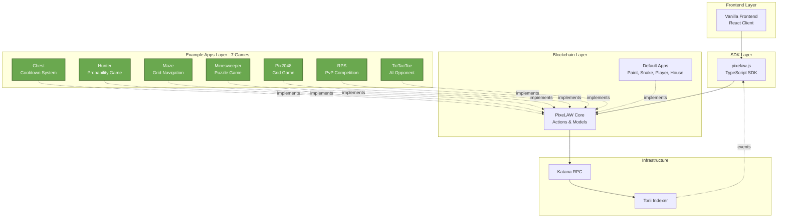

# PixeLAW Examples

<div align="center">


[](https://book.dojoengine.org)
[](https://book.cairo-lang.org)
[](../core/)

**A collection of game and application examples demonstrating PixeLAW's capabilities**

[Documentation](https://pixelaw.github.io/book/index.html) • [Core](../core/) • [SDK](../pixelaw.js/) • [Frontend](../vanilla/)

</div>

---

## What are PixeLAW Examples?

**PixeLAW Examples** is a curated collection of fully functional games and applications built on the PixeLAW framework. Each example demonstrates different patterns, mechanics, and capabilities of the platform—from simple cooldown systems to complex grid-based puzzles to PvP competition with cryptographic fairness.

These examples serve as:
- **Learning Resources**: Understand how to build PixeLAW apps by studying working code
- **Templates**: Start your own app by forking and modifying an example
- **Showcases**: Demonstrate the composability and power of the PixeLAW ecosystem
- **Test Bed**: Validate core functionality and app interaction patterns

Whether you're building your first PixeLAW app or exploring advanced features like App2App interactions, these examples provide concrete, production-ready implementations you can learn from and build upon.

---

## Architecture

PixeLAW Examples demonstrate how custom apps integrate with the ecosystem:



**Examples demonstrate**:
- Building custom apps that integrate with PixeLAW Core
- Different game mechanics and interaction patterns
- App2App interactions through the hook system
- Time-based mechanics with the queue system
- Spatial management with areas
- Testing strategies with pixelaw_test_utils

---

## Available Apps

| Name | Type | Description | Key Features |
|------|------|-------------|--------------|
| **[chest](./chest/)** | Cooldown System | Treasure chest placement and collection with time-based cooldowns | 24-hour cooldown mechanics, timestamp validation |
| **[hunter](./hunter/)** | Probability Game | Cryptographic randomness-based chance game | Poseidon hash randomness, 1/1024 winning odds |
| **[maze](./maze/)** | Grid Navigation | Navigate through pixel-based mazes with predefined layouts | Predefined layouts, randomization, pathfinding |
| **[minesweeper](./minesweeper/)** | Classic Puzzle | Traditional minesweeper with complex grid state management | Complex grid state, win/lose conditions, reveal mechanics |
| **[pix2048](./pix2048/)** | Grid Game | Fully on-chain 2048 with directional controls | Multi-pixel coordination, merge mechanics, directional input |
| **[rps](./rps/)** | PvP Competition | Rock-paper-scissors with commit-reveal cryptographic scheme | Commit-reveal pattern, cryptographic fairness, PvP logic |
| **[tictactoe](./tictactoe/)** | AI Opponent | Classic tic-tac-toe against a machine learning opponent | AI integration, game tree evaluation, win detection |

---

## App Patterns & Architecture

Each app demonstrates different PixeLAW development patterns:

### 🎯 Simple Single-Pixel Interactions
**chest, hunter**: Direct pixel interaction with minimal state management

```cairo
#[dojo::contract]
mod chest {
    fn interact(ref self: ContractState, position: Position) {
        // Simple state validation
        let chest = get!(self.world(), position, Chest);

        // Time-based logic
        assert(current_time > chest.cooldown, 'cooldown active');

        // Update via core actions
        core_actions.update_pixel(...);
    }
}
```

### 🎲 Complex Grid Games
**maze, minesweeper, pix2048**: Multi-pixel coordination and game boards

```cairo
#[dojo::contract]
mod minesweeper {
    fn reveal(ref self: ContractState, position: Position) {
        // Load board state
        let board = get!(self.world(), board_id, Board);

        // Check for mines, update multiple pixels
        let adjacent = get_adjacent_positions(position);
        for adj_pos in adjacent {
            core_actions.update_pixel(adj_pos, ...);
        }
    }
}
```

### ⚔️ Player vs Player Competition
**rps**: Turn-based competition with cryptographic security

```cairo
#[dojo::contract]
mod rps {
    fn commit(ref self: ContractState, move_hash: felt252) {
        // Commit phase: store hash
        set!(self.world(), RpsCommit { move_hash });
    }

    fn reveal(ref self: ContractState, move: Move, salt: felt252) {
        // Reveal phase: verify hash
        assert(poseidon_hash(move, salt) == stored_hash, 'invalid reveal');
        determine_winner(move, opponent_move);
    }
}
```

### 🤖 AI Integration
**tictactoe**: Machine learning opponent integration

```cairo
#[dojo::contract]
mod tictactoe {
    fn make_move(ref self: ContractState, position: Position) {
        // Player move
        update_board(position, Player::Human);

        // AI response
        let ai_move = calculate_best_move(board_state);
        update_board(ai_move, Player::AI);
    }
}
```

---

## Version Compatibility

| Component | Version | Notes |
|-----------|---------|-------|
| **Dojo Framework** | `1.7.1` | ECS framework for blockchain games |
| **PixeLAW Core** | `0.7.9` | Core contracts dependency (via git) |
| **Cairo** | `2.12.2` | Smart contract language |
| **Scarb** | `2.12.2` | Package manager and build tool |
| **Starknet** | `2.12.2` | Layer 2 blockchain |

> **⚠️ Breaking Changes in Dojo 1.7.1**: See `DOJO_1.7.1_UPGRADE_GUIDE.md` for migration details

---

## Quick Start

### Prerequisites
- **Rust** and **Cairo** language server - [Setup Guide](https://book.dojoengine.org/development/setup.html)
- **Dojo** 1.7.1 - [Installation](https://book.dojoengine.org/getting-started/quick-start.html)
- **Scarb** 2.12.2 - [Download](https://docs.swmansion.com/scarb/download)
- **Docker** and **Docker Compose** - [Install Docker](https://docs.docker.com/engine/install/)
- **Make** - [GNU Make](https://www.gnu.org/software/make/#download)

### Deploy All Apps (Recommended)

Start PixeLAW with all example apps in one command:

```bash
cd examples

# Deploy everything (core + all apps)
make start
```

This will:
1. Launch PixeLAW core infrastructure (Katana, Torii, Dashboard)
2. Wait for services to be ready
3. Deploy all 7 example apps with proper permissions
4. Initialize each app for immediate use

**Access the dashboard**: http://localhost:3000

To stop everything:
```bash
make stop
```

### Deploy Individual App

```bash
cd examples

# Start core infrastructure first
make start_core

# Deploy specific app
make deploy_app APP=chest

# Or use the deploy script directly
./deploy_apps.sh hunter
```

Available apps: `chest`, `hunter`, `maze`, `minesweeper`, `pix2048`, `rps`, `tictactoe`

### Manual Deployment (from app directory)

```bash
cd examples/chest

# Build the app
sozo build

# Deploy to local Katana (must be running)
sozo migrate

# Test the app
sozo test
```

---

## App Structure

All PixeLAW apps follow this consistent structure:

```
<app_name>/
├── src/
│   ├── lib.cairo               # Module declarations
│   ├── app.cairo               # Main app contract with interact() function
│   ├── constants.cairo         # App-specific constants (name, icon, etc.)
│   └── tests.cairo             # Integration tests
├── Scarb.toml                  # Package configuration
├── dojo_dev.toml               # Dojo configuration (world name, namespace)
├── Scarb.lock                  # Dependency lock file
├── LICENSE                     # MIT License
└── README.md                   # App-specific documentation
```

### Key Files

#### `src/lib.cairo`
Module declarations with test configuration:

```cairo
mod app;
mod constants;

#[cfg(test)]
mod tests;
```

#### `src/app.cairo`
Main application logic:

```cairo
#[dojo::contract]
mod my_app {
    use pixelaw::core::actions::{IActionsDispatcher, IActionsDispatcherTrait};

    #[abi(embed_v0)]
    impl MyAppImpl of IMyApp<ContractState> {
        fn interact(ref self: ContractState, position: Position) {
            let core = get_core_actions(ref self.world());

            // Your game logic

            core.update_pixel(...);
        }
    }

    // Initialize app (called automatically by Dojo)
    #[dojo::init]
    fn dojo_init(world: @IWorldDispatcher, systems: @Array<felt252>) {
        let core = get_core_actions_from(world);
        core.new_app(0.try_into().unwrap(), APP_KEY, APP_ICON);
    }
}
```

#### `Scarb.toml`
Package configuration with dependencies:

```toml
[package]
name = "my_app"
version = "1.7.1"

[dependencies]
dojo = { git = "https://github.com/dojoengine/dojo", tag = "v1.7.1" }
pixelaw = { git = "https://github.com/pixelaw/core", branch = "main" }

[dev-dependencies]
pixelaw_test_utils = { git = "https://github.com/pixelaw/core", branch = "main" }

[cairo]
sierra-replace-ids = true
allow-prebuilt-plugins = ["dojo_cairo_macros"]
```

#### `dojo_dev.toml`
Dojo-specific configuration:

```toml
[world]
name = "pixelaw-my_app"
description = "My PixeLAW App"

[[namespaces]]
default = "my_app"

[namespaces.bindings]
pixelaw = "pixelaw"
```

---

## Development Guide

### Building Apps

```bash
# Build all apps
make build_all

# Build specific app
cd chest
sozo build

# ⚠️ IMPORTANT: Always use `sozo build`, not `scarb build`
# sozo properly compiles Dojo contracts
```

### Testing Apps

```bash
# Test all apps
make test_all

# Test specific app
cd hunter
sozo test

# Run with verbose output
sozo test -v
```

### Formatting Code

```bash
# Format all apps
make fmt_all

# Format specific app
cd maze
scarb fmt
```

### Deployment Workflow

The `deploy_apps.sh` script handles deployment:

```bash
#!/bin/bash
./deploy_apps.sh <app_name>

# What it does:
# 1. Waits for Katana at localhost:5050
# 2. Builds with `sozo build`
# 3. Migrates with `sozo migrate --wait`
# 4. Dojo auto-initializes via dojo_init function
```

**Makefile commands**:
```bash
make start              # Deploy all apps (full setup)
make deploy_all         # Deploy all apps to running infrastructure
make deploy_app APP=chest  # Deploy individual app
make start_core         # Start core infrastructure
make stop_core          # Stop core infrastructure
make reset              # Reset with volume cleanup
```

---

## Testing Strategies

### Integration Testing with pixelaw_test_utils

All apps should include comprehensive integration tests:

```cairo
use pixelaw_test_utils::{setup_core, setup_apps, set_caller};

#[test]
fn test_chest_placement() {
    // Setup core and apps
    let (world, core_actions, _) = setup_core();

    // Set caller for permission checks
    let player = starknet::contract_address_const::<0x1337>();
    set_caller(player);

    // Test chest placement
    let position = Position { x: 0, y: 0 };
    chest_actions.place_chest(position);

    // Verify state
    let chest = get!(world, position, Chest);
    assert(chest.placer == player, 'wrong placer');
    assert(!chest.collected, 'should not be collected');
}

#[test]
#[should_panic(expected: ('cooldown active',))]
fn test_chest_cooldown() {
    // Test that cooldown prevents collection
    let (world, core_actions, _) = setup_core();

    chest_actions.place_chest(position);
    chest_actions.collect_chest(position);  // Should panic
}
```

### Testing Patterns

**Success scenarios**:
```cairo
#[test]
fn test_successful_action() {
    // Test normal operation
}
```

**Failure scenarios**:
```cairo
#[test]
#[should_panic(expected: ('error message',))]
fn test_permission_denied() {
    // Test access control
}
```

**State validation**:
```cairo
#[test]
fn test_state_changes() {
    // Verify pixel state before and after
    let pixel_before = get!(world, position, Pixel);

    app_actions.interact(position);

    let pixel_after = get!(world, position, Pixel);
    assert(pixel_after.color != pixel_before.color, 'color unchanged');
}
```

---

## Important Dojo 1.7.1 Breaking Changes

⚠️ **If upgrading from earlier Dojo versions**, be aware of these breaking changes:

### 1. Enums MUST Derive Default
```cairo
// ❌ Old (will not compile)
#[derive(Serde, Copy, Drop, Introspect)]
enum Direction {
    Up,
    Down,
    Left,
    Right
}

// ✅ New (required in Dojo 1.7.1)
#[derive(Serde, Copy, Drop, Introspect, Default)]
enum Direction {
    #[default]
    Up,
    Down,
    Left,
    Right
}
```

### 2. Scarb.toml Must Allow Prebuilt Plugins
```toml
[cairo]
sierra-replace-ids = true
allow-prebuilt-plugins = ["dojo_cairo_macros"]  # Required!
```

### 3. Testing Requires TEST_CLASS_HASH
```cairo
// ❌ Old
let world = spawn_test_world("pixelaw", array![]);

// ✅ New
let world = spawn_test_world("pixelaw", array![], world::TEST_CLASS_HASH);
```

### 4. ContractAddress Conversion
```cairo
// ❌ Old (deprecated)
let addr = starknet::contract_address_const::<0x1337>();

// ✅ New
let addr: ContractAddress = 0x1337.try_into().unwrap();
```

See `DOJO_1.7.1_UPGRADE_GUIDE.md` for complete migration details.

---

## Contributing

We welcome new example apps and improvements to existing ones!

### Code Style

#### Cairo Conventions
- **Functions**: `snake_case` (e.g., `place_chest`, `reveal_cell`)
- **Types/Structs**: `PascalCase` (e.g., `Chest`, `Board`)
- **Constants**: `SCREAMING_SNAKE_CASE` (e.g., `APP_KEY`, `COOLDOWN_DURATION`)
- **Enums**: `PascalCase` with variants in `PascalCase`

#### Modern Dojo Patterns
- Use `WorldStorage` and `ModelStorage` for reading/writing models
- Always derive `Default` for enums with `#[default]` attribute
- Use `.try_into().unwrap()` for `ContractAddress` conversion
- Include `allow-prebuilt-plugins` in `Scarb.toml`

### Testing Requirements

All apps must include:
1. **Placement/initialization tests**: Verify app setup works
2. **Success scenario tests**: Test normal operation
3. **Failure scenario tests**: Test error conditions with `#[should_panic]`
4. **State validation tests**: Verify pixel and model state changes
5. **Permission tests**: Validate access control

### Creating a New Example App

```bash
# 1. Create directory
mkdir examples/my_app
cd examples/my_app

# 2. Initialize Scarb package
cat > Scarb.toml << EOF
[package]
name = "my_app"
version = "1.7.1"

[dependencies]
dojo = { git = "https://github.com/dojoengine/dojo", tag = "v1.7.1" }
pixelaw = { git = "https://github.com/pixelaw/core", branch = "main" }

[dev-dependencies]
pixelaw_test_utils = { git = "https://github.com/pixelaw/core", branch = "main" }

[cairo]
sierra-replace-ids = true
allow-prebuilt-plugins = ["dojo_cairo_macros"]
EOF

# 3. Create dojo_dev.toml
cat > dojo_dev.toml << EOF
[world]
name = "pixelaw-my_app"

[[namespaces]]
default = "my_app"

[namespaces.bindings]
pixelaw = "pixelaw"
EOF

# 4. Create source files
mkdir -p src
touch src/lib.cairo src/app.cairo src/constants.cairo src/tests.cairo

# 5. Implement app logic following patterns from existing apps

# 6. Test locally
sozo build
sozo test

# 7. Add to Makefile and submit PR
```

### Pull Request Process

1. **Create your app** following the structure above
2. **Add comprehensive tests** covering success and failure scenarios
3. **Run all checks**:
   ```bash
   sozo build    # Must compile successfully
   sozo test     # All tests must pass
   scarb fmt     # Format code
   ```
4. **Update README** with your app in the Available Apps table
5. **Create PR** with:
   - Description of game mechanics
   - Demo video or screenshots (if applicable)
   - Link to any related issues

---

## Development Commands Reference

### Makefile Commands

```bash
# Deployment
make start                 # Deploy all apps (full setup)
make start_core            # Start core infrastructure
make stop                  # Stop everything
make stop_core             # Stop core only
make reset                 # Reset with volume cleanup

# App Operations
make deploy_all            # Deploy all apps
make deploy_app APP=chest  # Deploy individual app
make build_all             # Build all apps
make test_all              # Test all apps
make fmt_all               # Format all apps

# Monitoring
make log_katana            # View Katana logs
make log_torii             # View Torii logs
make log_bots              # View bot logs
make shell                 # Access container shell
```

### Docker Compose Services

```bash
# Services run at:
# - Katana (blockchain): http://localhost:5050
# - Torii (indexer): http://localhost:8080
# - Dashboard: http://localhost:3000

# View status
docker compose ps

# View all logs
docker compose logs -f

# View specific service
docker compose logs -f katana
docker compose logs -f torii

# Restart service
docker compose restart katana
```

---

## Resources

### Documentation
- **PixeLAW Book**: [pixelaw.github.io/book](https://pixelaw.github.io/book/index.html)
- **Dojo Framework**: [book.dojoengine.org](https://book.dojoengine.org)
- **Cairo Language**: [book.cairo-lang.org](https://book.cairo-lang.org)
- **Dojo 1.7.1 Migration**: `DOJO_1.7.1_UPGRADE_GUIDE.md`

### Related Repositories
- **Core Contracts**: [../core/](../core/) - PixeLAW foundational framework
- **SDK (pixelaw.js)**: [../pixelaw.js/](../pixelaw.js/) - TypeScript SDK for frontend integration
- **Frontend (Vanilla)**: [../vanilla/](../vanilla/) - React client for PixeLAW

### Individual App Documentation
Each app has its own README with specific implementation details:
- [chest/README.md](./chest/README.md) - Cooldown mechanics
- [hunter/README.md](./hunter/README.md) - Randomness patterns
- [maze/README.md](./maze/README.md) - Grid navigation
- [minesweeper/README.md](./minesweeper/README.md) - Complex state management
- [pix2048/README.md](./pix2048/README.md) - Multi-pixel coordination
- [rps/README.md](./rps/README.md) - Commit-reveal pattern
- [tictactoe/README.md](./tictactoe/README.md) - AI integration

### Community
- **Discord**: [Join PixeLAW Discord](https://t.co/jKDjNbFdZ5)
- **Twitter**: [@0xpixelaw](https://x.com/0xpixelaw)
- **GitHub Issues**: [Report bugs or request features](https://github.com/pixelaw/examples/issues)

### Credits

| Contribution | Developer |
|--------------|-----------|
| [pix2048](https://github.com/themetacat/PixeLAW2048) | [MetaCat](https://github.com/themetacat) |

---

## License

All examples are licensed under the MIT License - see individual LICENSE files for details.

---

<div align="center">

**Built with ❤️ by the PixeLAW community**

[🎮 Try PixeLAW](https://demo.pixelaw.xyz) • [📖 Read the Docs](https://pixelaw.github.io/book) • [💬 Join Discord](https://t.co/jKDjNbFdZ5)

</div>
